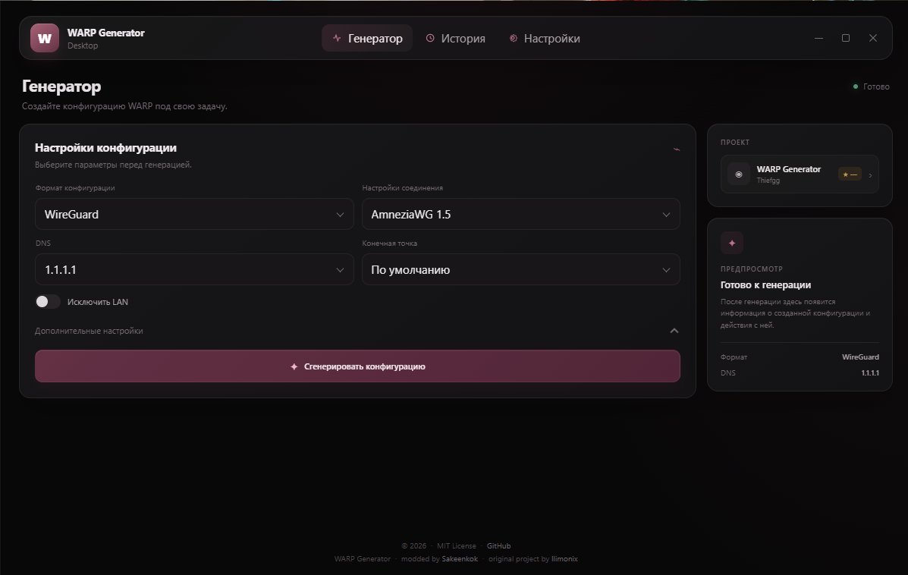
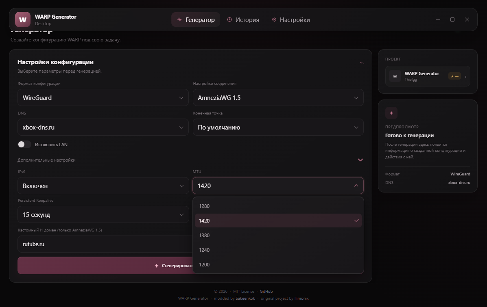
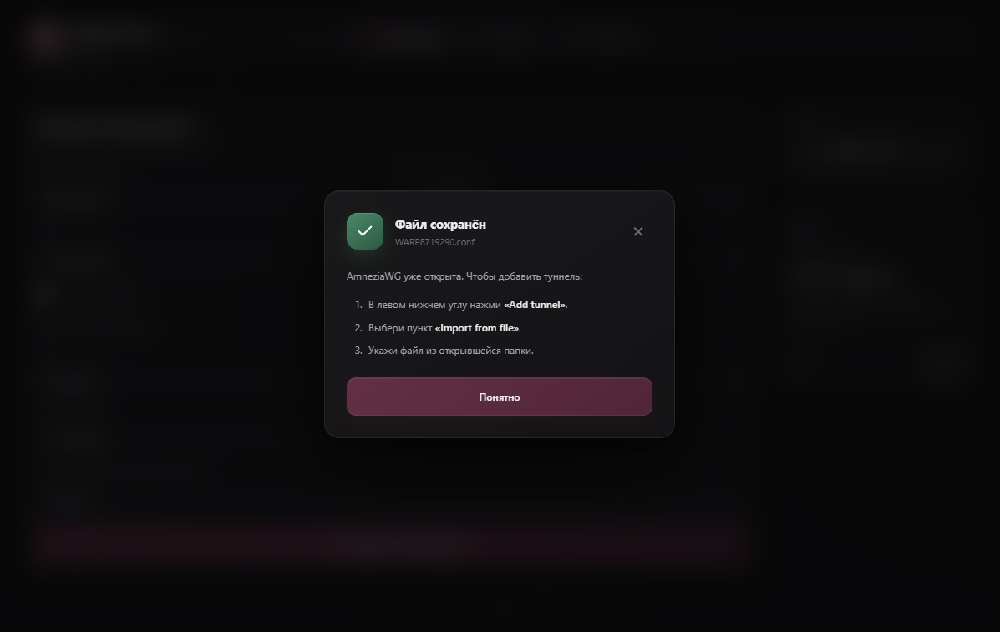

# WARP Generator Desktop

[English](README.md) | **Русский**

!!! Может плохо работать с московскими интернет-провайдерами !!!
В следующем обновлении я добавлю реле для обхода блокировки API Cloudflare на уровне интернет-провайдера.



Десктопное приложение для генерации конфигураций Cloudflare WARP и AmneziaWG. Написано на Tauri и Rust.

Проект — десктопный форк оригинальной веб-версии с [warp3.llimonix.pw](https://warp3.llimonix.pw) от [nellimonix](https://github.com/nellimonix). Автор оригинала указан внизу.

## Об этом форке

Это мой личный форк с собственным UI, брендингом и фичами. Веб-версия того же проекта:

- Сайт: https://warp.sakeen.ru
- GitHub (веб): https://github.com/Thiefgg/warp-config-generator-vercel
- GitHub (десктоп): https://github.com/Thiefgg/warp-generator-desktop

## Скриншоты

Главный интерфейс:


Раскрытые настройки генератора:



После клика по «Открыть в AmneziaWG» — конфиг сохранён, AmneziaWG открыта с инструкцией по импорту:



## Установка

Скачай последний инсталлятор в разделе [Releases](https://github.com/Thiefgg/warp-generator-desktop/releases).

| Файл | Описание |
| --- | --- |
| `WARP Generator_x.x.x_x64-setup.exe` | Установщик NSIS (рекомендуется) |
| `WARP Generator_x.x.x_x64_en-US.msi` | MSI-пакет |

Требуется Windows 10 (2020 или новее) или Windows 11. WebView2 уже встроен в обе.

## Сборка из исходников

Что нужно:

- Node.js 18 или новее
- Rust 1.75 или новее
- [Зависимости Tauri](https://tauri.app/start/prerequisites/) для твоей ОС

```bash
git clone https://github.com/Thiefgg/warp-generator-desktop.git
cd warp-generator-desktop
npm install
npm run tauri dev      # разработка
npm run tauri build    # релизный инсталлятор
```

Инсталлятор появится в `src-tauri/target/release/bundle/`.

## Структура проекта

```text
├── src/
│   ├── main.ts
│   ├── styles.css
│   └── assets/
│
├── src-tauri/
│   ├── src/
│   │   ├── lib.rs
│   │   ├── main.rs
│   │   ├── i1_masks.rs
│   │   └── quic.rs
│   ├── capabilities/
│   ├── icons/
│   ├── Cargo.toml
│   └── tauri.conf.json
│
├── index.html
├── package.json
├── tsconfig.json
└── vite.config.ts
```

## Конфигурация

Переменные окружения не нужны. Приложение анонимно регистрируется в публичном Cloudflare WARP API.

## Поддерживаемые платформы

| Платформа | Статус |
| --- | --- |
| Windows 10 (2020+) | Работает |
| Windows 11 | Работает |
| macOS | Не тестировалось |
| Linux | Не тестировалось |

## Ссылки

Мои:

- Сайт: https://warp.sakeen.ru
- GitHub (веб): https://github.com/Thiefgg/warp-config-generator-vercel
- GitHub (десктоп): https://github.com/Thiefgg/warp-generator-desktop
- Telegram: https://t.me/dar1ysu

Оригинальный проект:

- Сайт: https://warp3.llimonix.pw
- GitHub: https://github.com/nellimonix/warp-config-generator-vercel

## Лицензия

MIT. Полный текст — в файле [LICENSE](LICENSE).

Форк сохраняет лицензию и attribution оригинального проекта.

## Star history

[](https://www.star-history.com/?repos=Thiefgg%2Fwarp-generator-desktop&type=date&legend=bottom-right)

---

Основано на open-source работе [llimonix / nellimonix](https://github.com/nellimonix/warp-config-generator-vercel).

Кастомизировано и поддерживается [Sakeenkok](https://github.com/Thiefgg).
